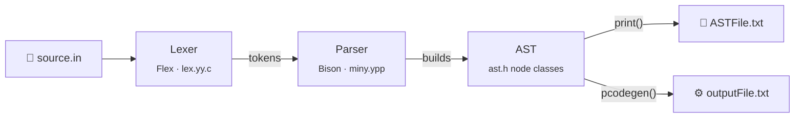

<div align="center">

# ⚙️ Pascal-like → P-code Compiler

**A compiler written in C++ with Flex & Bison that translates a small Pascal-like language into P-machine stack code.**


</div>

---

## 📖 Overview

This project is a full **code generator** for *miny*, a Pascal-like teaching language. It reads a source program, builds an **abstract syntax tree**, and walks that tree to emit **P-code**: the instruction set of the P-machine, the classic stack-based virtual machine used to teach compiler construction.

It was built across three assignments in the *Compiler Structure* course at the **University of Haifa**. Each assignment extended the same compiler to handle more of the language:

| Stage | What the compiler learned to do |
|---|---|
| **HW1** | Expressions, assignments, `IF`/`ELSE`, `WHILE` loops, `CASE` statements, `WRITE` |
| **HW2** | Data structures: multi-dimensional **arrays**, **records**, **pointers** (`^`) and `NEW` |
| **HW3** | **Procedures and functions**: nesting, recursion, by-value and by-reference parameters, and passing **procedures as parameters** |

### ✨ Highlights

- 🧱 **Nested procedures with static links**: inner procedures can read and write variables of every enclosing scope.
- 🔁 **Recursion**: functions call themselves and return values through their own name, as in Pascal.
- 🔗 **Two parameter modes**: by value (default) and by reference (`IDENTICAL`).
- 🧩 **Higher-order procedures**: procedures and functions can be passed as arguments and called indirectly.
- 📦 **Composite types**: nested arrays (`ARRAY[1:3] OF ARRAY[1:4] OF ...`), records, and pointers, including records that point to themselves.
- ✅ **Automated tests**: `make test` compiles every example and checks it against its expected P-code.

---

## 🚀 Quick start

**Requirements:** `gcc`/`g++` and `make` (or CMake ≥ 3.16). Flex and Bison are **not** needed, because the generated lexer and parser are committed.

```bash
git clone https://github.com/AhmadKais/pascal-pcode-compiler.git
cd pascal-pcode-compiler

make                               # builds ./pcodeGen
./pcodeGen examples/input4.in      # compiles a program
cat outputFile.txt                 # the generated P-code
cat ASTFile.txt                    # a dump of the abstract syntax tree

make test                          # runs the whole example suite
```

<details>
<summary><b>Building with CMake instead</b></summary>

```bash
cmake -S . -B build
cmake --build build
./build/pcodeGen examples/input4.in
```

</details>

> **Note:** the compiler always writes its results to `outputFile.txt` and `ASTFile.txt` in the **current directory**. It also prints a Bison parser trace to `stderr`; add `2>/dev/null` to hide it.

---

## 🔍 Example

This program declares a **recursive function** with an `IF`/`ELSE` and a logical OR (`examples/input4.in`):

```pascal
PROGRAM h
      i FIXED;
      j FIXED;

    FUNCTION a(n FIXED, m FIXED) : FIXED
    {
        i = 4;
        IF (n < 1) THEN
            i = 0;
        FI

        IF ((m == 1) | (n == 2)) THEN
            j = 1;
        ELSE
            j = i + a(n - 2, 6);
        FI
        a = 5;
    }
{
    a(i, 2);
}
```

The compiler turns it into this P-code:

<details open>
<summary><b>Generated P-code</b> (<code>outputFile.txt</code>)</summary>

```text
h:                      ; ── program entry ──
ssp 7                   ; reserve the global frame (5 admin cells + i, j)
sep 50                  ; max expression-stack depth
ujp h_begin
a:                      ; ── FUNCTION a ──
ssp 7                   ; frame: 5 admin cells + n, m
sep 50
ujp a_begin
a_begin:
lda 1 5                 ; i = 4      (i lives one static level up)
ldc 4
sto
lda 0 5                 ; IF n < 1
ind
ldc 1
les
fjp end_if_1
lda 1 5                 ;   i = 0
ldc 0
sto
end_if_1:
lda 0 6                 ; IF m == 1 | n == 2
ind
ldc 1
equ
lda 0 5
ind
ldc 2
equ
or
fjp else_if_2
lda 1 6                 ;   j = 1
ldc 1
sto
ujp end_if_2
else_if_2:
lda 1 6                 ;   j = i + a(n - 2, 6)
lda 1 5
ind
mst 1                   ;   recursive call: mark stack...
lda 0 5
ind
dec 2                   ;   ...push n - 2...
ldc 6                   ;   ...push 6...
cup 2 a                 ;   ...and call a with 2 parameter cells
add
sto
end_if_2:
lda 0 0                 ; a = 5   (the return value lives at offset 0)
ldc 5
sto
retf                    ; return from function
h_begin:                ; ── main body ──
mst 0
lda 0 5
ind
ldc 2
cup 2 a                 ; a(i, 2)
stp
```

</details>

*(The comments were added by hand for this README; the compiler emits bare instructions.)*

---

## 🏗️ How it works



1. **Lexing**: the Flex-generated scanner (`src/lex.yy.c`) turns characters into tokens like `PROCEDURE`, `IDE`, `INTCONST` and `ASSIGN`.
2. **Parsing**: the Bison grammar (`src/miny.ypp`) checks the syntax and builds the AST. Every grammar rule creates a node object (`Program`, `ProcedureDeclaration`, `Assign`, `Expr`, `ArrayRef`, `RecordRef`, …).
3. **Semantic information**: as the tree is walked, a **symbol table** records each variable's type, size, nesting depth and frame offset. A separate list tracks every procedure and function, its parameters, and how each one is passed.
4. **Code generation**: each AST node class implements `pcodegen()`, which emits the P-code for its own construct and recurses into its children. `main.cpp` calls it on the root.

### Runtime model

Each procedure call creates a **stack frame** on the P-machine:

| Offset | Contents |
|---|---|
| `0` | Function return value |
| `1`–`4` | Administration: static link, dynamic link, saved extreme-stack pointer, return address |
| `5…` | Parameters, then local variables |

- Variables are addressed as **`lda d o`**, where `d` is the difference in static nesting depth between the use and the declaration, and `o` is the offset in that frame. This is how nested procedures reach outer variables.
- **By-reference** parameters store an *address*, so every use adds an extra `ind`.
- **Array** value parameters are copied into the callee's frame with `movs`.
- **Procedures passed as parameters** are stored as a code address plus a static link, and called with `mstf` / `smp` / `cupi`.

### P-code instructions used

| Instruction | Meaning |
|---|---|
| `ldc c` | Push the constant `c` |
| `lda d o` | Push the address of the variable at depth difference `d`, offset `o` |
| `ind` | Replace the address on top of the stack with the value it points to |
| `sto` | Store the value on top into the address below it |
| `inc k` / `dec k` | Add / subtract `k` to the top of the stack (also used for record field offsets) |
| `ixa k` | Array indexing: address + index × element size `k` |
| `movs n` | Copy an `n`-cell block (array/record passed by value) |
| `add` `sub` `mul` `neg` | Arithmetic |
| `les` `grt` `equ` `or` … | Comparison and logic |
| `ujp L` / `fjp L` | Unconditional jump / jump if false |
| `ixj L` | Indexed jump into a `CASE` jump table |
| `ssp n` / `sep n` | Set the frame size / maximum expression-stack depth |
| `mst d` / `cup p L` | Mark the stack for a call / call procedure `L` with `p` parameter cells |
| `mstf` `smp` `cupi` | The same, for calls through a procedure parameter |
| `retp` / `retf` | Return from a procedure / function |
| `new` | Allocate memory on the heap for a pointer (`NEW`) |
| `print` | Print the top of the stack (`WRITE`) |
| `stp` | Stop the program |

---

## 📝 Language reference

### Program structure

```pascal
PROGRAM name
    <declarations>          -- variables, procedures and functions
{
    <statements>            -- the main body
}
```

Statement bodies are wrapped in `{ … }`. Declarations come before the body they belong to, and procedures can be nested to any depth.

### Types

| Syntax | Meaning |
|---|---|
| `FIXED` | Integer |
| `FLOAT` | Real number |
| `BOOLEAN` | `TRUE` / `FALSE` |
| `ARRAY[lo:hi] OF T` | Array with bounds `lo`…`hi` (nest for more dimensions) |
| `RECORD { f1 T1; f2 T2; }` | Record with named fields |
| `^T` | Pointer to `T` |
| `name` | A previously declared type or procedure (used for procedure parameters) |

### Declarations

```pascal
count FIXED;                                  -- variable
grid  ARRAY[1:3] OF ARRAY[1:4] OF FIXED;      -- 2-D array
node  RECORD { value FIXED; next ^node; };    -- record with a self-pointer

PROCEDURE swap (a FIXED IDENTICAL, b FIXED IDENTICAL)   -- by-reference parameters
{ ... }

FUNCTION square (x FIXED) : FIXED             -- returns a value
{
    square = x * x;                           -- assign to the function's name to return
}

PROCEDURE apply (f swap)                      -- takes a procedure as a parameter
{ ... }
```

### Statements

| Statement | Syntax |
|---|---|
| Assignment | `x = expr;` |
| Conditional | `IF cond THEN … FI` or `IF cond THEN … ELSE … FI` |
| Loop | `WHILE cond { … }` |
| Multi-way branch | `CASE expr OF { 1: … 2: … }` |
| Procedure call | `p(a, b);` or `p();` |
| Output | `WRITE(expr);` or `WRITE("text");` |
| Allocation | `NEW(ptr);` |

### Expressions

| Category | Operators |
|---|---|
| Arithmetic | `+` `-` `*` `/` `%`, unary `-` |
| Comparison | `<` `<=` `>` `>=` `==` |
| Logic | `&` (and), `\|` (or), `NOT` |
| Access | `a[i][j]` (array), `r.field` (record), `p^` (pointer dereference) |
| Calls | `f(x, y)` (a function call is an expression) |

Precedence from lowest to highest: comparisons → `+ - |` → `* / & %` → unary `-` / `NOT` → `.` → `^`.

---

## 🧪 Tests

`make test` compiles each program in `examples/` and compares the output with the expected P-code. The comparison ignores blank lines, line endings and the `sep` value (see [Known limitations](#%EF%B8%8F-known-limitations)).

```text
$ make test
PASS  examples/input1.in
PASS  examples/input2.in
...
PASS  examples/input9.in
9 passed, 0 failed
```

| Example | What it exercises |
|---|---|
| `input1` | By-reference (`IDENTICAL`) and by-value parameters, writing to globals |
| `input2` | By-value parameters, `WRITE` |
| `input3` | Nested procedures, static links, a local array |
| `input4` | Recursive function, `IF`/`ELSE`, logical OR |
| `input5` | Passing a procedure as a parameter, `WHILE` loop |
| `input6` | Function return values, local variables |
| `input7` | Procedure parameters passed on through several nesting levels |
| `input8` | Procedure parameters combined with by-reference arguments |
| `input9` | Records with pointer fields, record parameters, `^` dereferencing |
| `input10` | Array value parameters and a nested function *(no expected output; compile only)* |

---

## 📁 Project structure

```text
.
├── src/
│   ├── ast.h            # AST node classes, symbol table and P-code generation
│   ├── main.cpp         # entry point: parse → write AST → generate code
│   ├── main.h
│   ├── miny.ypp         # Bison grammar
│   ├── miny.tab.cpp/hpp # parser generated from miny.ypp
│   └── lex.yy.c         # Flex-generated lexer
├── examples/            # inputN.in programs and their expected pcodeN.txt
├── tests/run.sh         # test runner used by `make test`
├── docs/                # the original assignment specifications (PDF)
├── Makefile
└── CMakeLists.txt
```

---

## ⚠️ Known limitations

- **`sep` is an upper bound.** The compiler always emits `sep 50` instead of computing the exact maximum depth of the expression stack. Programs still run correctly; they just reserve more stack than they need.
- **Fixed output file names.** Results always go to `outputFile.txt` and `ASTFile.txt` in the working directory.
- **The lexer source isn't included.** Only the generated `lex.yy.c` is in the repository. The parser can be regenerated with `bison -d -o src/miny.tab.cpp src/miny.ypp`.
- **Reserved but unimplemented keywords.** The lexer recognizes `FOR`, `REPEAT`, `READ`, `GOTO` and `LABEL`, but the grammar has no rules for them yet.
- **Debug output.** The Bison trace (`yydebug`) is always on and printed to `stderr`.

---

## 🎓 Course & credits

Built for **Compiler Structure** (Theory of Compilation) at the **University of Haifa**, taught by **Prof. Yosi Ben Asher**, fall semester 2022–2023.

- **Course framework:** the original parser/AST skeleton was provided by the course staff (Yosi Ben Asher and Mariah Akree).
- **Code generation, symbol table and runtime model:** implemented by **[Ahmad Kais](https://github.com/AhmadKais)** and **Mohannad Abu-Hamad**.
- **Assignment specifications:** in [`docs/`](docs/).

> If you're taking this course now, use this repository to learn from, not to copy, and write your own solution. 🙂
